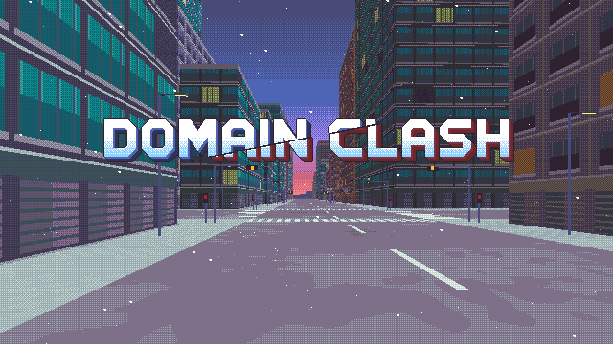
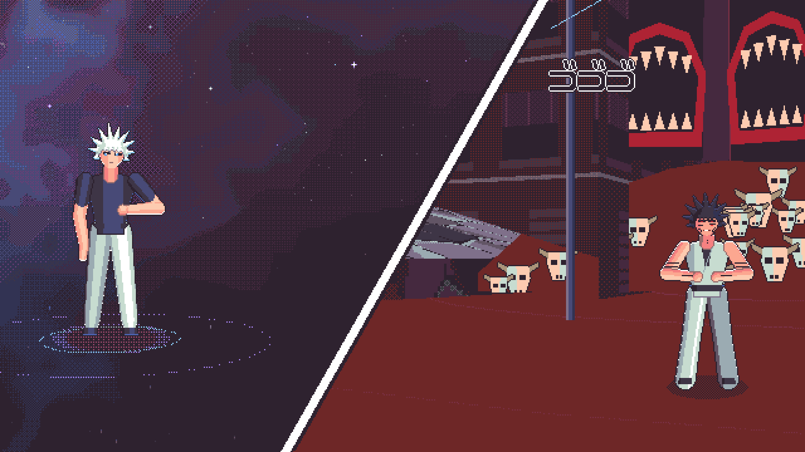
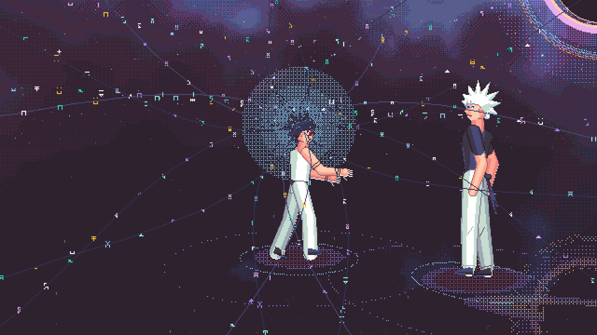
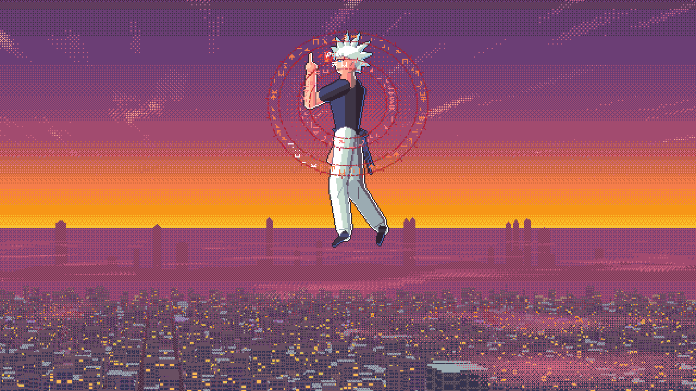
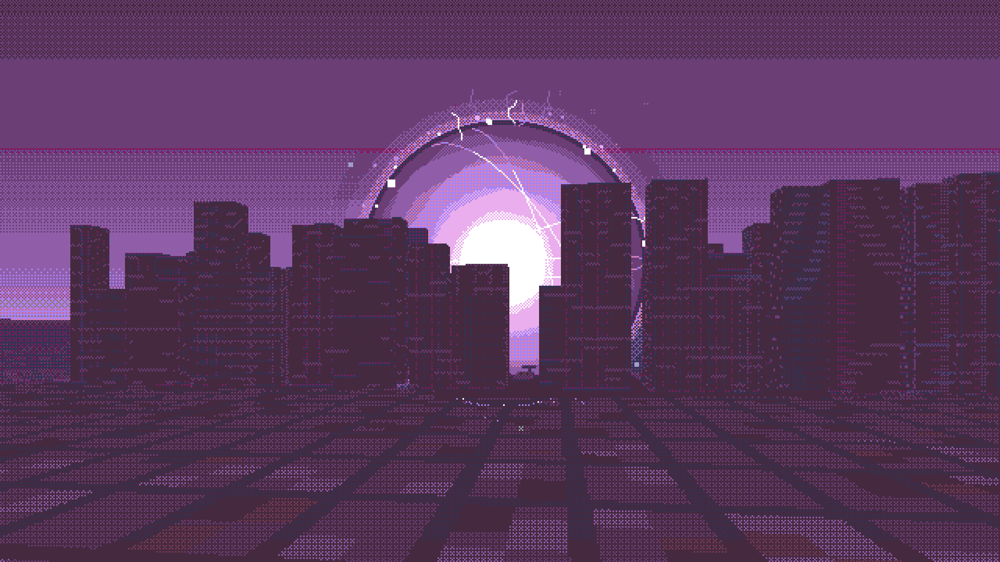

# DOMAIN CLASH



A 20-minute, dialogue-free 2.5D pixel-art fan film of the Gojo vs Sukuna fight (Jujutsu Kaisen, "Shinjuku Showdown",
ch. 221–236) — made entirely of code. No image files, no audio samples, no voices, no libraries: every pixel is drawn
by JavaScript on a 640×360 canvas and every note, hit and gust of wind is synthesized with the Web Audio API.
*Jujutsu Kaisen © Gege Akutami / Shueisha. Unofficial, non-commercial fan work.*

| | |
|---|---|
|  |  |
|  |  |

**How it was made.** Written end to end by Claude Code (Anthropic's Claude Opus 5) from a written brief. A director
session planned the film, wrote the core engine and Acts I–II, and did every review, integration and export;
sub-agents built the audio engine and the score, the FX library, the manga/text system, the close-up busts, the
shikigami and coda cast and the interior/domain sets, and wrote Acts III, IV and V–VI. Seven milestones (M0–M6), each
verified with contact sheets, per-frame budgets (< 8 ms), real-time playthroughs and frame-exact video exports — see
[PROGRESS.md](PROGRESS.md) for every decision, deviation from canon and measurement.

* **Watch:** **[play it in your browser](https://minewefu.github.io/domain-clash/)** (GitHub Pages; desktop Chrome, Edge or
  Firefox recommended), or download `dist/domain-clash.html` (one self-contained 2.2 MB file) and open it. Press *Play
  with sound*. Keys: Space play/pause · ←/→ 5 s · M mute · F fullscreen · 1–6 acts.
* **Develop:** open `index.html` directly (classic scripts, works from `file://`).
* **Video:** the MP4s are not in the repository (the 1080p film is 2 GB). Render them yourself, frame-exact and
  verified after writing: `node tools/export.mjs --strict --qp 13 [--act I] [--scale 3|2]` (Chrome + Node ≥ 22; see
  PROGRESS.md judgment calls 22–23 for the quality gates).
* **Plan and status:** `SPEC.md` (production bible: canon notes, APIs, the choreography DSL), `PROGRESS.md`
  (milestones, judgment calls, research sources, verification log).

## How it works

| Layer | File | What it does |
|---|---|---|
| Engine | `src/core.js` | Resurrect 64 palette + Yliluoma-style ordered-dither quantizer, aliased primitives, fonts, sprites, Mode-7/iso/sprite-stack helpers, bounded caches (inherited from *Hello, Tomorrow*, upgraded to 640×360) |
| Player | `src/main.js`, `src/ui.js`, `src/timeline.js` | Acts → scenes, chapter streaming (lazy idle-time init, disposal outside a window), transitions, audio-clock sync, act menu, test modes |
| Camera | `src/cam.js` | Pinhole camera with lens shift, projection, the shot library (wide, medium, OTS, close-up, ECU, crash zoom, dolly zoom, orbit, overhead, path, follow) |
| Rig | `src/rig.js`, `src/chars.js`, `src/chars_shiki.js`, `src/poses.js` | 2D skeletal rig rasterized in software: FK → G-buffer (material/tone/layer) with cel shading → ink outline, inner lines, rim light; stateless springs for hair/cloth; 19 characters, 280+ poses; moves with frame data |
| Choreography | `src/fight.js` | One DSL for every scene: actions, moves with auto-spacing, hit-stop and reactions, camera shots, FX, SFX, kana, post effects, persistent damage |
| World | `src/city.js`, `src/sets.js` | One procedural Shinjuku (521 buildings, streets, signals, props, an elevated expressway) + a damage ledger keyed to film time; street-level 3D renderer (textured walls column by column, roofs, props, ground, skyline, a depth buffer that occludes FX and fighters), Voxel Space flyover, overhead map |
| Interiors, domains | `src/sets_rooms.js` | The Unlimited Void, the watchers' room inside Rika (a tower of CRTs carrying a live mini-render of the city), the school corridor, the airport lounge, the sky above the clouds; the clash tally |
| Acts | `src/act2_extra.js` … `src/act6_extra.js`, `src/scenes/*.js` | Per-act staging constants, poses and FX; 60 scene files (one `HT.fightScene` each) |
| FX | `src/fx.js` | Techniques (Infinity, Blue, Red, Purple, Dismantle/Cleave, World-Cutting Slash, Black Flash), domains, physical and graphic effects, weather (≈ 90 effects with the act extras) |
| Graphics | `src/manga.js`, `src/busts.js` | Pixel katakana onomatopoeia, screentone manga mode, split-screen panels, act/place/title cards, hand-authored close-up busts |
| Sound | `src/audio/*.js` | Web Audio synthesizer: lookahead scheduler, offline + chunked render with a deterministic JS master (true-peak limiter), 31 instruments (incl. Karplus-Strong koto/shamisen, shakuhachi, taiko, FM temple bell), 97 SFX, 11 ambience beds, themes and a cue-anchored score per act |

## Tools

```
node tools/build.mjs                          # → dist/domain-clash.html + dist/artifact.html (+ regenerates tools/export.html)
node tools/review.mjs --acts I --act I --perf # contact sheets (2×), transitions, cue + flash-cap validation, perf → shots/review/
node tools/cdp.mjs --page "index.html?scene=a1_title&t=4&scale=2" --shot shots/x.png   # one frame
node tools/cdp.mjs --page "index.html?lab=rig&char=gojo" --shot shots/poses.png        # labs: rig sizes moves one fx sets busts kana manga …
node tools/playthrough.mjs --act I --flags disable-gpu   # real-time playback: frame gaps at lazy-init boundaries, heap samples
node tools/trace.mjs --secs 8 --query "acts=I&silent=1"   # Chrome performance trace: attributes rAF gaps (main thread / GPU / GC)
node tools/jsprof.mjs --page "index.html?acts=II&lab=noop" --run "<expr>" [--pre "<warm-up>"] [--lines fn] [--callers fn]   # V8 CPU profile: self time per function, hot lines, callers
node tools/export.mjs --strict --act I        # frame-exact MP4 (WebCodecs + hand-written muxer), verified after writing
node tools/cdp.mjs --page tools/audio-lab.html --eval "await runChecks()" --timeout 600000   # soundtrack analysis
```

## Sources the techniques are grounded in

* Resurrect 64 palette — Kerrie Lake, https://lospec.com/palette-list/resurrect-64
* Arbitrary-palette positional dithering — Joel Yliluoma, https://bisqwit.iki.fi/story/howto/dither/jy/
* Voxel Space (Comanche, 1992) — Sebastian Macke, https://github.com/s-macke/VoxelSpace
* Wall/floor casting (column-wise perspective-correct walls, per-row floors) — the Wolfenstein/Doom lineage
* Hit-stop and frame data — 3rd Strike per-frame traces (baston.esn3s.com), Garou (SuperCombo wiki), Sakurai on hitstop
* Screen shake as trauma² — Squirrel Eiserloh, GDC 2016 "Juicing Your Cameras With Math"
* Dialogue-free storytelling — Genndy Tartakovsky's *Primal* (interviews: Cartoon Brew, CGMagazine, Collider)
* Web Audio lookahead scheduling — "A Tale of Two Clocks", https://web.dev/articles/audio-scheduling
* Canon — Jujutsu Kaisen Fandom chapter pages 221–236; Wikipedia chapter list (see PROGRESS.md)
